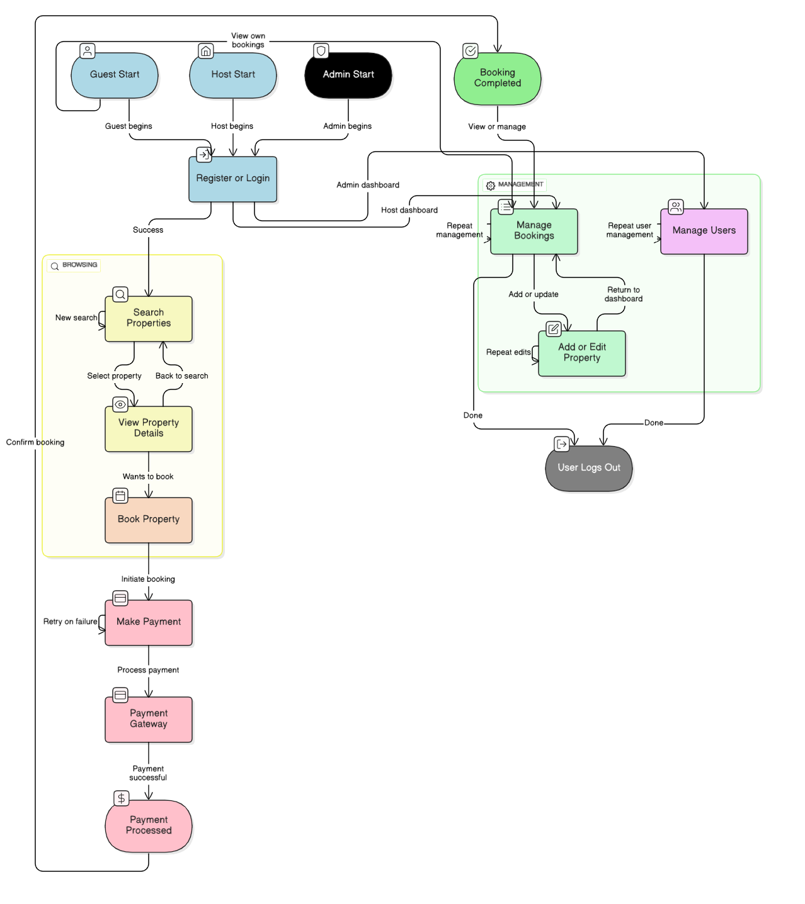

# Requirement Analysis in Software Development  
This repository is dedicated to exploring **Requirement Analysis**, a critical phase in the Software Development Life Cycle (SDLC).

## Purpose
The goal of this repository is to:
- Understand how requirements are gathered, analyzed, documented, and validated.  
- Provide structured examples and notes on functional and non-functional requirements.  
- Serve as a learning resource for requirement analysis techniques and best practices.  

------
## What is Requirement Analysis?

**Requirement Analysis** is the process of discovering, clarifying, organizing, and validating what a software system must do and how it should perform. It turns stakeholder needs (users, customers, product owners, business teams, and engineers) into clear, testable, and agreed upon **requirements** that guide design, development, and testing.

### Why it matters in the SDLC
- **Prevents scope creep:** Clear requirements set boundaries for what will (and will not) be built.
- **Reduces rework & cost:** Finding gaps early is far cheaper than fixing them during coding or after release.
- **Aligns the team:** Creates a single source of truth for product, engineering, QA, and stakeholders.
- **Improves quality:** Well defined acceptance criteria make testing objective and thorough.
- **Prioritizes value:** Helps deliver the most important features first.

### Where it fits
Requirement Analysis sits early in the SDLC after idea/feasibility and before design/implementation. Its outputs (user stories, use cases, specifications) feed directly into design and development.

------------

## Why is Requirement Analysis Important?

Requirement Analysis is critical because:

1. **It Reduces Risk and Cost**  
   Discovering unclear or conflicting requirements early reduces rework and development cost.

2. **Ensures Alignment with Business Goals**  
   Proper analysis ensures the delivered software meets stakeholder needs and business objectives.

3. **Improves Project Planning and Prioritization**  
   Clear requirements help teams estimate effort, prioritize features, and allocate resources effectively.

4. **Enhances Product Quality**  
   When requirements include measurable acceptance criteria, testing becomes objective and thorough.

5. **Prevents Scope Creep**  
   Well documented requirements define what is in scope and out of scope, helping control changes.

-------------

## Key Activities in Requirement Analysis

The main activities include:

- **Requirement Gathering (also called Elicitation):**  
  Collecting stakeholder needs using interviews, surveys, workshops, observation, and reviewing existing systems.

- **Requirement Elicitation (refinement):**  
  Refining and exploring gathered ideas through brainstorming, prototyping, and scenarios to expose hidden assumptions and clarify needs.

- **Requirement Documentation:**  
  Writing clear, structured requirements (user stories, use cases, SRS items) that are unambiguous and testable.

- **Requirement Analysis and Modeling:**  
  Analyzing requirements to identify conflicts, dependencies and modeling behaviour with diagrams (use cases, activity diagrams, flowcharts).

- **Requirement Validation:**  
  Reviewing and validating requirements with stakeholders to ensure accuracy, completeness, and feasibility (walkthroughs, reviews, acceptance tests).

-------------

## Types of Requirements

### Functional Requirements
Functional requirements describe **what the system should do** - the features and functions the system must provide.

**Examples for a Booking Management System:**
- **User Registration & Profiles:** Users can create accounts, edit profiles, and reset passwords.
- **Property Search & Filters:** Users can search properties by location, date, price range, and amenities.
- **Booking/Reservation:** Users can select dates, reserve a property, and receive confirmation.
- **Payment Processing:** Securely process payments (credit card, mobile money, or other gateways).
- **Booking Management:** Users can view, modify, and cancel bookings; hosts can manage availability and bookings.
- **Notifications:** Email/SMS notifications for booking confirmations, cancellations, and reminders.

### Non-Functional Requirements
Non-functional requirements describe **how the system should perform** - quality attributes like performance, security, scalability, and usability.

**Examples for a Booking Management System:**
- **Performance:** Search results should return within **2 seconds** for 95% of queries.
- **Availability:** System uptime ≥ **99.9%**.
- **Scalability:** Support up to **5,000 concurrent users** during peak periods (example metric).
- **Security:** All user passwords must be stored hashed; payment data must comply with PCI-DSS best practices.
- **Usability & Accessibility:** Responsive UI that works on mobile and desktop; follows basic accessibility guidelines (e.g., keyboard navigation).
- **Data Retention & Privacy:** User data retained per privacy policy; GDPR/Local regulation compliance where applicable.
--------

## Use Case Diagrams

**What is a Use Case Diagram?**  
A Use Case Diagram shows the interactions between **actors** (users or external systems) and the system’s **use cases** (functionalities). It helps visualize who does what and the scope of the system.

**Benefits**
- Quickly communicates system scope to stakeholders.
- Shows actor–system interactions and main features.
- Useful during requirement elicitation and validation.

**Actors & Use Cases (for Booking Management System)**
- **Actors:** Guest/User, Host, Admin, Payment Gateway
- **Use Cases:** Register / Login, Search Properties, View Property Details, Book Property, Make Payment, Manage Bookings, Add/Edit Property (Host), Manage Users (Admin), Send Notifications




--------
## Acceptance Criteria

### What are Acceptance Criteria?  
Acceptance Criteria are specific, measurable conditions that a feature must satisfy to be considered complete and acceptable to stakeholders. They turn requirements into testable statements.

### Importance of Acceptance Criteria
- Make requirements testable and unambiguous.
- Provide a clear definition of done for the team.
- Help QA create meaningful test cases and acceptance tests.
- Reduce misunderstandings between stakeholders and developers.

**Example - Checkout Feature (Booking Management System)**

**User Story:** As a guest, I want to complete a booking purchase so that I can reserve a property for selected dates.

**Acceptance Criteria (list):**
1. **Successful Booking and Payment**
   - Given a guest has selected a property and valid dates,
   - When they provide valid payment details and confirm,
   - Then the booking is created, payment is processed, and the guest receives a confirmation email with booking details.

2. **Payment Failure Handling**
   - Given payment fails due to declined card or gateway error,
   - When the guest tries to confirm payment,
   - Then the booking is not created and a clear error message is shown with options to retry or use another payment method.

3. **Double Booking Prevention**
   - Given another guest has just booked the same property for overlapping dates,
   - When a guest attempts to book overlapping dates,
   - Then the system prevents the booking and informs the guest that dates are no longer available.

4. **Data Validation**
   - All required fields (name, payment info, dates) must be validated on client and server side; invalid inputs block submission with user-friendly messages.

**Gherkin-style scenario (example)**
```gherkin
Scenario: Successful checkout and booking confirmation
  Given the guest is logged in and has selected property "Seaside Villa" for 2025-09-10 to 2025-09-12
  And the guest provides valid payment details
  When the guest confirms payment
  Then the system should process the payment successfully
  And a booking record should be created
  And an email confirmation should be sent to the guest

-----------
